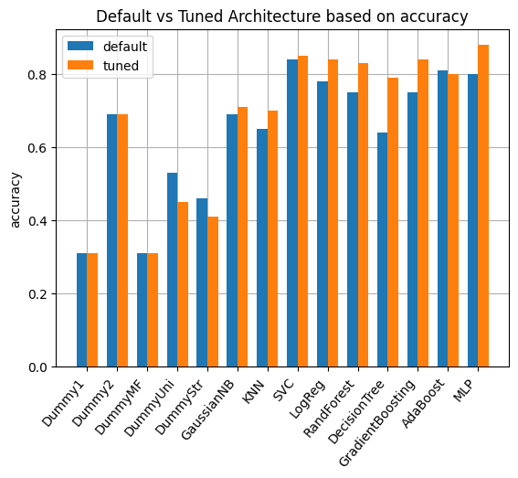

# LSVT Voice Rehabilitation Classification

## Project Overview

This project aims to develop a robust machine learning model to classify the acceptability of patients' voices post-rehabilitation. Accurate classification of voices into acceptable and unacceptable categories is critical for evaluating the success of rehabilitation procedures and guiding further treatments. Our solution focuses on building a high-performance classification system in Python using three separate models to correctly replicate the experts' binary assessment. We experimented with default and tuned architectures for each model type, optimizing performance through hyperparameter tuning using grid search. The results were then compared using various performance metrics, including accuracy, precision, recall, F1 score and confusion matrices.

## Theoretical Background

Lee Silverman Voice Treatment (LSVT) is a speech therapy program that helps people with Parkinson's disease (PD) and other conditions improve their ability to speak and be understood. LSVT focuses on:

- Loudness: Recalibrating a person's perception of their own voice volume so they speak at a more normal level. 
- High-effort vocalization: Encouraging patients to make high-effort vocalizations. 
- Intensive therapy: Providing an intensive therapy plan.
- Calibration: Teaching patients how much effort is needed to raise their voice. 
- Quantification: Evaluating a patient's performance to motivate them.

## Methodology

1. **Problem Framing**: We identified the key challenge as classifying patient voices into acceptable (1) and unacceptable (2) categories, where identifying unacceptable cases (true positives) is critical.

2. **Data Preprocessing**: The dataset was cleaned, scaled and split into training and testing sets to ensure fair evaluation of the models.

3. **Model Selection**: A diverse set of machine learning models was explored to classify voice rehabilitation success. Our selection was driven by a combination of model interpretability, performance and their ability to handle different data structures and distributions.

4. **Hyperparameter Tuning**: We conducted a comprehensive grid search for each model to fine-tune hyperparameters and optimize performance. The goal was to improve metrics such as accuracy and F1 score.

6. **Performance Comparison**: After tuning the models, we selected the best architectures and compared their performance across key metrics, with special attention to identifying true positives in the unacceptable class. Confusion matrices were also used to visualize classification errors.

## Model Selection and Hyperparameter Tuning

### Initial Model Selection

We began with a broad range of models to compare the performance of their tuned and default architectures. Below is a summary of the models examined:

- **Dummy Classifiers**: We used several baseline classifiers to establish a minimal benchmark for performance. Specifically, we defined a) *Dummy1* and *Dummy2* for constant strategies, where predictions are always 1 or 2 respectively, b) *DummyMF* for always predicting the most frequent class, c) *DummyUni* for uniform random predictions and d) *DummyStr* for stratified predictions based on class distribution.
- **Gaussian Naive Bayes (GaussianNB)**: A probabilistic model using Gaussian distribution assumptions.
- **K-Nearest Neighbors (KNN)**: A distance-based algorithm that classifies based on the labels of nearby points in the dataset.
- **Support Vector Classifier (SVC)**: A powerful classifier that works by finding the optimal hyperplane separating the classes.
- **Logistic Regression**: A linear model used for binary classification.
- **Random Forest**: An ensemble learning method combining multiple decision trees to increase accuracy and reduce overfitting.
- **Decision Tree**: A model that splits the data into branches based on feature thresholds.
- **Gradient Boosting Classifier**: An ensemble model that builds decision trees sequentially to improve performance.
- **AdaBoost Classifier**: A boosting technique that adjusts the weights of observations and builds models iteratively.
- **Multi-Layer Perceptron Classifier (MLPClassifier)**: A type of artificial neural network known for its flexibility and ability to capture non-linear relationships.

### Hyperparameter Tuning

Each model's performance was improved by tuning key hyperparameters using a grid search approach. Below, we detail the key hyperparameters chosen for tuning and their role in model performance:

#### GaussianNB:

```
var_smoothing: Controls the variance of the Gaussian smoothing applied to each feature.
```

#### KNN:
```
n_neighbors: Number of neighbors to consider for majority voting.
weights: Determines whether the neighbors' votes are weighted by distance or uniformly.
p: Power parameter for the Minkowski distance metric.
```

#### SVC:
```
C: Regularization parameter for the trade-off between margin and classification error.
kernel: Choice of kernel function (linear, radial basis, polynomial, sigmoid).
gamma: Defines how far the influence of a single training example reaches.
```

#### Logistic Regression:
```
C: Inverse of regularization strength.
solver: Algorithm to use for optimization.
max_iter: Maximum number of iterations taken for the solvers to converge.
```

#### Random Forest:
```
n_estimators: Number of trees in the forest.
max_features: Number of features to consider when looking for the best split.
max_depth: Maximum depth of the tree.
```

#### Decision Tree:
```
criterion: Function to measure the quality of a split (Gini impurity or entropy).
max_depth: Limits the depth of the tree to prevent overfitting.
min_samples_split: Minimum number of samples required to split a node.
```

#### Gradient Boosting:
```
n_estimators: Number of boosting stages to perform.
learning_rate: Shrinks the contribution of each tree by this factor.
max_depth: Controls the depth of individual trees.
```

#### AdaBoost:
```
n_estimators: Number of boosting stages.
learning_rate: Controls the contribution of each weak learner.
```

#### MLPClassifier:
```
hidden_layer_sizes: Number of neurons in each hidden layer.
solver: Optimization algorithm (adam, sgd, lbfgs).
activation: Activation function for the hidden layer (ReLU, tanh).
alpha: L2 penalty (regularization term) to prevent overfitting.
max_iter: Maximum number of iterations during training.
```

### Cross-Validation and Scoring Criteria

To ensure the robustness of our results, cross-validation was applied during model evaluation, particularly using k-fold cross-validation. This process helped prevent overfitting by training the model on multiple subsets of the data and assessing its performance on unseen subsets. We used certain scoring criteria to evaluate the models:

- Accuracy: The percentage of correctly classified samples.
- F1-micro Score: The overall F1 score computed by aggregating the contributions of all classes and then computing the average. This metric is useful for evaluating models in terms of their performance across all classes.
- F1-macro Score: The average F1 score computed for each class independently and then averaged. This metric gives equal weight to each class, making it particularly useful for evaluating models on imbalanced datasets.

The final models were selected based on their performance across these metrics. The three classification models that were selected are: a) *Support Vector Classifier (SVC)*, b) *Logistic Regression* and c) *Multi-layer Perceptron Classifier (MLPClassifier)*.

## Solutions and Data Insights

### Default vs Tuned Model Architectures

We analyzed the impact of hyperparameter tuning on model performance by plotting the comparison of default and tuned architectures for all three models. The following plots depict the score for different default and tuned architectures. The main difference between the plots is the scoring criterion based on which the best tuned architecture is selected for each model type. The scoring criterion for the first plot is the accuracy. The scoring criterion for the second plot is the F1-micro. The scoring criterion for the third plot is the F1-macro.




Key takeaway: Models like KNN and GaussianNB are generally outperformed by more complex models like SVC, Logistic Regression and MLPClassifier. This is expected, as simpler models may not capture complex patterns in a high-dimensional dataset.

### Final Model Testing Accuracy Comparison

We compared the final testing statistics of the SVC, Logistic Regression and MLPClassifier models. Our analysis reveals that Logistic Regression outperforms the other models with the highest testing accuracy (85%), while SVC and MLPClassifier both achieve 81%. The following plot depects the testing accuracy of the tuned architectures for three models types. The architectured were tuned based on the scoring criteria of accuracy, F1-micro and F1-macro.


Key takeaway: Logistic Regression stands out with high accuracy, making it an excellent choice for the task.

### Confusion Matrix Analysis and F1 Scores

The confusion matrices for the final models reveal detailed classification performance for both acceptable (1) and unacceptable (2) categories:

- For SVC, the precision is high (88.89%), but the F1-macro score is lower compared to Logistic Regression, indicating potential room for improvement in handling the imbalanced data, as it struggles with the minority class.
- Logistic Regression has consistent precision, recall and F1 scores (all approximately 89%), indicating that it balances both classes well.
- MLPClassifier shows a good F1 score (87.18%) and the highest recall (89.47%), making it a good option for identifying true positives, which might be crucial for identifying unacceptable voice rehabilitation outcomes. However, its F1-macro score is also lower compared to Logistic Regression, indicating potential room for improvement in handling the imbalanced data.

| Model              | Tuned Hyperparameters (based on F1-macro)                                 | Accuracy | Precision | Recall | F1 score | F1-micro | F1-macro |
|--------------------|---------------------------------------------------------------------------|----------|-----------|--------|----------|----------|----------|
| SVC                | C=1, gamma='auto'                                                         | 80.8%    | 88.9%     | 84.2%  | 86.5%    | 80.8%    | 76.6%    |
| Logistic Regression| C=0.1, solver='liblinear'                                                 | 84.6%    | 89.5%     | 89.5%  | 89.5%    | 84.6%    | 80.5%    |
| MLPClassifier      | alpha=0.001, hidden_layer_sizes=(100, 50, 25), max_iter=1000, solver='sgd'| 80.8%    | 85.0%     | 89.5%  | 87.2%    | 80.6%    | 74.4%    |

Key takeaway: The Logistic Regression and MLPClassifier appear to be the best options for identifying unacceptable voice rehabilitation outcomes, which may be the most critical aspect of this application. Their ability to maximize recall ensures fewer false negatives, leading to more accurate identification of problematic cases that require further intervention.

## Conclusion

This project demonstrated the power of machine learning in addressing complex, real-world challenges in voice rehabilitation classification. Through comprehensive model selection, tuning and evaluation, we found that Logistic Regression and Neural Networks provided the most accurate and reliable performance, especially in identifying unacceptable cases, which could be crucial for improving patient outcomes. Further enhancements could involve adding more features or experimenting with ensemble techniques to boost model performance even further. The current solution, however, is robust and can be used for deployment in clinical settings.

## Dataset
Tsanas, A. (2014). LSVT Voice Rehabilitation [Dataset]. UCI Machine Learning Repository. https://doi.org/10.24432/C52S4Z.
